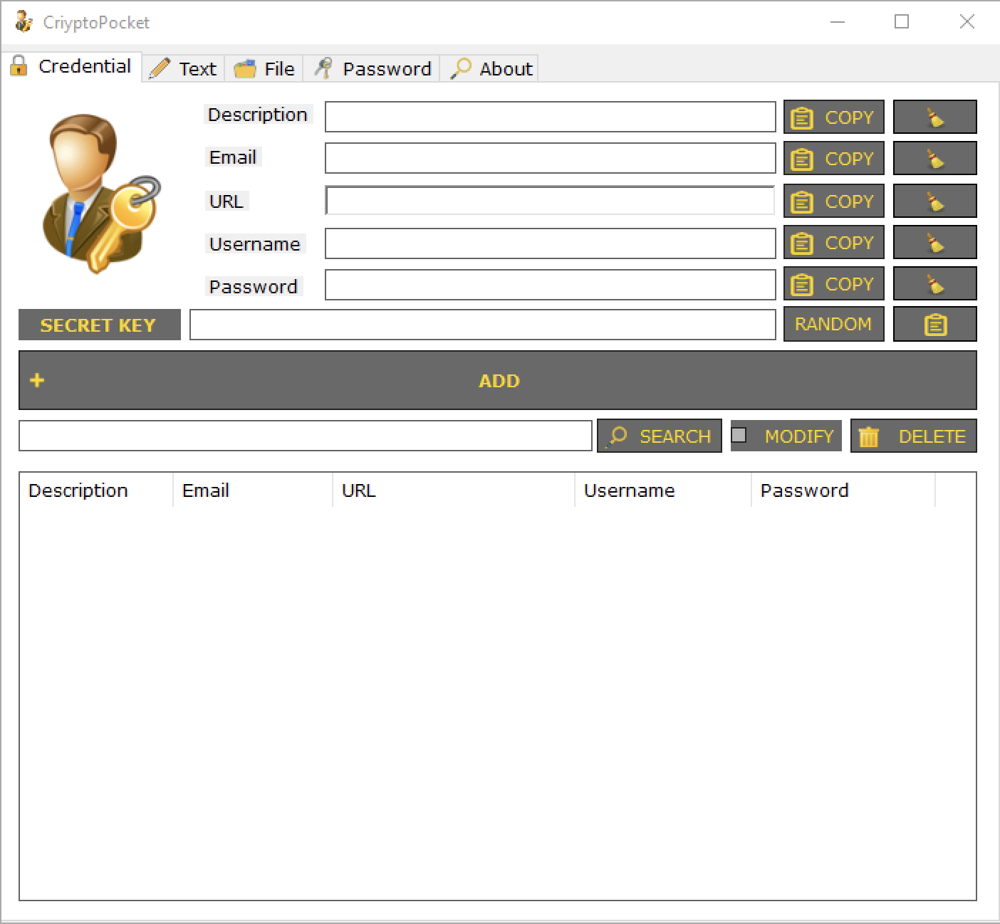

# cryptopocket

Save your access credentials, encrypt text messages or local files and then decrypt them at any time, providing the desired key, with this simple program all this is possible. Feel free to tweaks to your liking :slightly_smiling_face:

 

