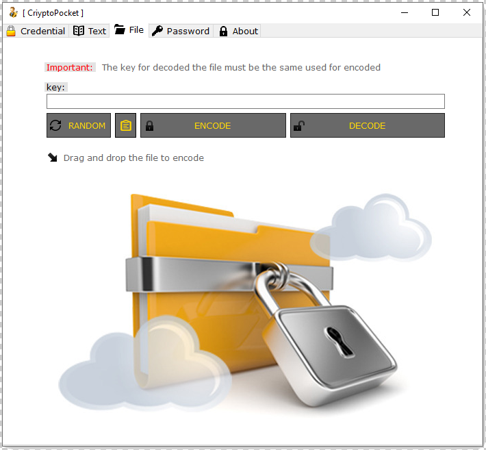
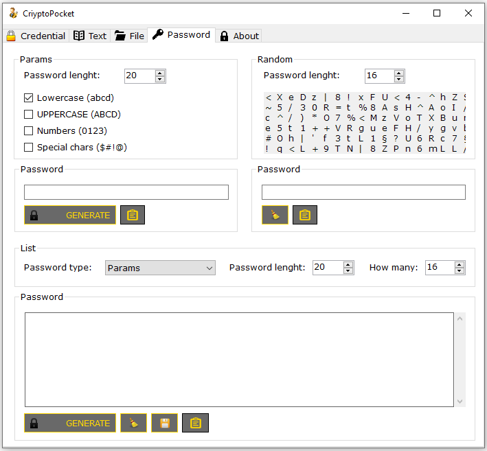

# CryptoPocket

Save your access credentials, encrypt text messages or local files and then decrypt them at any time, providing the desired key, with this simple program all this is possible. No installation required, portable.

Nowadays, we have to manage so many accounts that keeping track of all their login details is a truly challenging task. Unless you want to use the same password on every single website, you may need a software utility to help you out.

CryptoPocket is a relatively simple application that not only enables you to encrypt and store all your credentials, but can also encode text and secure files, as well as decrypt them.

 

## Store your account credentials in a secure manner

CryptoPocket allows you to create a local database in which all your login details are stored in an encrypted form. You can enter each account’s name, email address, URL, username and password, as well as provide the encryption key.

Once an entry has been created, the username and password can only be viewed if the original key is available.

You can also search for specific items based on their description, associated email or URL, but the entries cannot be sorted.

 

## Encode-decode texts

When you wish to encrypt a document or message, you can either write the text manually or import a local TXT file. The encoded content is saved in the same folder and can only be decrypted with the correct key.

 

## Encode-decode files

Things are more or less the same when encrypting files, without any format restrictions.

 

## Generate random passwords

Generate secure credentials at will.

 

## Contributing

Fell free to make it much safer and to improve it. PR are welcome and greatly appreciated. Thanks!

## License

